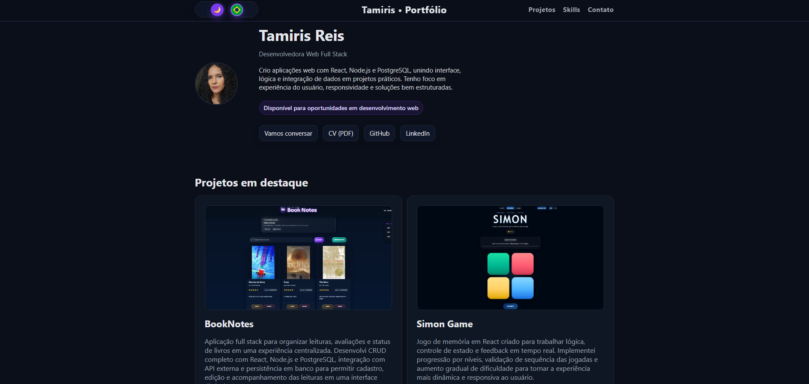
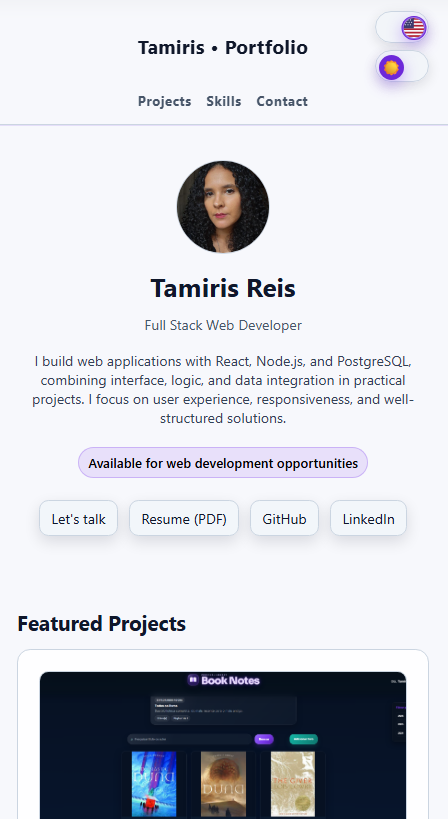

# Tamiris Reis | Portfólio Full Stack


Desenvolvedora full stack em formação, com foco em React, Node.js, PostgreSQL e criação de interfaces responsivas, acessíveis e bem estruturadas.

Portfólio pessoal desenvolvido para apresentar meus principais projetos, habilidades técnicas e formas de contato de maneira clara, responsiva e profissional.

## Demonstração

Deploy: https://portfolio-flax-nu-pr3ch93pap.vercel.app/

## Preview

<p align="center">
  
  
</p>

## Sobre o projeto

Este portfólio funciona como uma apresentação central do meu trabalho como desenvolvedora full stack, com foco em projetos desenvolvidos com React, JavaScript, Node.js e PostgreSQL.

A interface foi criada para ser simples de navegar, responsiva em diferentes tamanhos de tela e direta para recrutadores, clientes e pessoas técnicas que queiram conhecer meus projetos.

## Destaques

- Layout responsivo para desktop, tablet e mobile
- Alternância entre português e inglês
- Alternância entre tema claro e escuro
- Seção de projetos com imagens, descrição, tecnologias, deploy e repositório
- Seção de skills organizada por categoria
- Contato direto por e-mail e WhatsApp
- Build otimizado com Vite

## O que este projeto demonstra

- Organização de componentes reutilizáveis em React
- Gerenciamento de estado para idioma, tema e navegação ativa
- Criação de layout responsivo com CSS moderno
- Atenção a acessibilidade com labels, estados de foco e navegação semântica
- Uso de assets otimizados para projetos, screenshots e favicon
- Estrutura simples para manutenção, evolução e deploy

## Tecnologias

- React
- JavaScript
- CSS
- Vite
- HTML

## Projetos em destaque

- BookNotes: aplicação full stack para organizar leituras, avaliações e status de livros.  
  Deploy: https://book-notes-vvs0.onrender.com  
  Repositório: https://github.com/tamicoding/book-notes
- Simon Game: jogo de memória em React com progressão de níveis e validação de sequência.  
  Deploy: https://simon-game-react-nine.vercel.app/  
  Repositório: https://github.com/tamicoding/simon-game-react
- Star Wars Universe: projeto frontend temático com consumo de APIs externas.  
  Deploy: https://tamicoding.github.io/starwars-universe/  
  Repositório: https://github.com/tamicoding/starwars-universe
- Sábios do Multiverso: aplicação de citações traduzidas com integração de API.  
  Deploy: https://sabios-do-multiverso.vercel.app/  
  Repositório: https://github.com/tamicoding/sabios-do-multiverso

## Como rodar localmente

```bash
npm install
npm run dev
```

Para gerar a versão de produção:

```bash
npm run build
```

## Contato

Tamiris Reis

- LinkedIn: https://www.linkedin.com/in/tamirisfreis/
- GitHub: https://github.com/tamicoding
- E-mail: tamirisfr@live.com

---

# English Summary

Full stack developer in training, focused on React, Node.js, PostgreSQL, and responsive web interfaces.

This portfolio presents my selected projects, technical skills, language/theme switches, responsive layout, and direct contact options.

- Live Demo: https://portfolio-flax-nu-pr3ch93pap.vercel.app/
- Tech Stack: React, JavaScript, CSS, Vite, HTML
- Demonstrates: reusable React components, state management, responsive CSS, accessibility care, asset organization, and deploy-ready structure
- Contact: [LinkedIn](https://www.linkedin.com/in/tamirisfreis/) | [GitHub](https://github.com/tamicoding) | tamirisfr@live.com

## Featured Projects

- BookNotes: [Live Demo](https://book-notes-vvs0.onrender.com) | [Repository](https://github.com/tamicoding/book-notes)
- Simon Game: [Live Demo](https://simon-game-react-nine.vercel.app/) | [Repository](https://github.com/tamicoding/simon-game-react)
- Star Wars Universe: [Live Demo](https://tamicoding.github.io/starwars-universe/) | [Repository](https://github.com/tamicoding/starwars-universe)
- Sages of the Multiverse: [Live Demo](https://sabios-do-multiverso.vercel.app/) | [Repository](https://github.com/tamicoding/sabios-do-multiverso)

## Running Locally

```bash
npm install
npm run dev
npm run build
```
